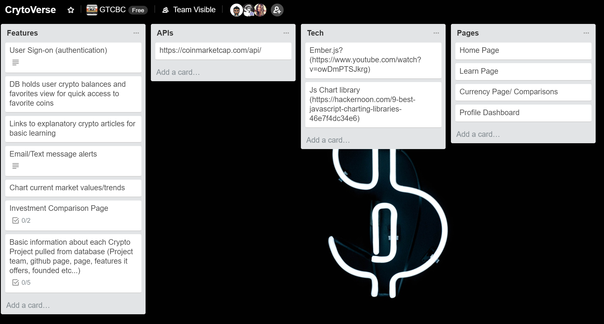

# Project Title:  Cryptoverse

## Team Members:  Susan Davenport, Allen Welch, Eddie Rodriguez
## GitHub URL:  https://github.com/erodriguez87/cryptoverse

### Project Description:
To provide a learning and comparison application for newcomers in the world of cryptocurrency. The application give users an intro to the top projects in the industry complete with links to learn more about each project, see relevant information, and compare investment opportunities. 

### New Technology: Charting library (deciding which one), Authentication using JSON web token, auth0, oboe

### High level responsibilities
 Currently working on dividing responsibilities. We tend to be versatile as a group and pitch in where needed. We will have more concrete descriptions by thursday. 

 